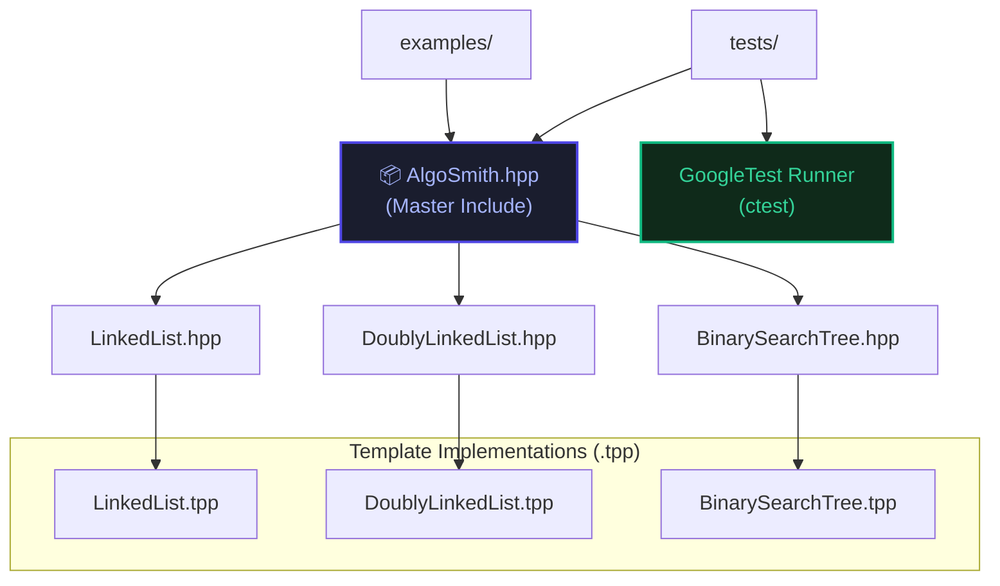

<div align="center">

<br/>

```
 █████╗ ██╗      ██████╗  ██████╗ ███████╗███╗   ███╗██╗████████╗██╗  ██╗
██╔══██╗██║     ██╔════╝ ██╔═══██╗██╔════╝████╗ ████║██║╚══██╔══╝██║  ██║
███████║██║     ██║  ███╗██║   ██║███████╗██╔████╔██║██║   ██║   ███████║
██╔══██║██║     ██║   ██║██║   ██║╚════██║██║╚██╔╝██║██║   ██║   ██╔══██║
██║  ██║███████╗╚██████╔╝╚██████╔╝███████║██║ ╚═╝ ██║██║   ██║   ██║  ██║
╚═╝  ╚═╝╚══════╝ ╚═════╝  ╚═════╝ ╚══════╝╚═╝     ╚═╝╚═╝   ╚═╝   ╚═╝  ╚═╝
```

### *Production-Grade C++ Data Structures Library*

<br/>

[](https://en.cppreference.com/w/)
[](https://cmake.org/)
[](https://google.github.io/googletest/)
[](https://cmake.org/)
[](LICENSE)

<br/>

> *"Not a tutorial project with shortcuts. Precision engineering — every method exception-safe, every class Rule-of-Five complete."*

**[🐛 Report Bug](https://github.com/ARI-900/DSA_LIBRARY_AlgoSmith/issues) &nbsp;·&nbsp; [✨ Request Feature](https://github.com/ARI-900/DSA_LIBRARY_AlgoSmith/issues) &nbsp;·&nbsp; [📖 Documentation](https://dsa-library-algosmith.onrender.com)**

<br/>

</div>

---

## ⚡ What Is This?

**AlgoSmith** is a professional-grade, header-only C++ library that implements essential data structures and algorithms with production-quality code. Each data structure is carefully engineered with:

- 🎯 **Template-based design** for type safety and performance
- 🧪 **Comprehensive unit tests** using Google Test framework
- 📊 **Working examples** demonstrating real-world usage
- 🛡️ **Memory safety** through RAII principles
- 🚀 **Zero dependencies** — pure standard C++17

This is not a learning library with shortcuts. This is **precision engineering** for developers who want production-ready data structures they can rely on.

---

## 📋 Table of Contents

- [What's Implemented](#-whats-implemented)
- [Core Design Principles](#-core-design-principles)
- [Project Architecture](#-project-architecture)
- [Data Structures Deep Dive](#-data-structures-deep-dive)
- [Tech Stack](#-tech-stack)
- [Project Structure](#-project-structure)
- [Quick Start](#-quick-start)
- [Building & Testing](#-building--testing)
- [Integration Guide](#-integration-guide)
- [Memory & Exception Safety](#-memory--exception-safety)
- [Roadmap](#-roadmap)
- [Contributing](#-contributing)
- [Author](#-author)

---

## ✅ What's Implemented

| # | Data Structure | API Class | Tests | Status |
|---|---|---|---|---|
| 1 | Singly Linked List | `algosmith::LinkedList<T>` | 28 tests | ✅ Stable |
| 2 | Doubly Linked List | `algosmith::DoublyLinkedList<T>` | 30 tests | ✅ Stable |
| 3 | Binary Search Tree | `algosmith::BinarySearchTree<T>` | 35 tests | ✅ Stable |
| 4 | Graph | — | 🔧 Planned |
| 5 | Sorting | — | 🔧 Planned |

**Total: 93 tests across 3 suites — 0 failures.**

---

## 🏛 Core Design Principles

### 1. Rule of Five — No Exceptions

Any class managing raw memory implements all five special members. This is non-negotiable:

```cpp
LinkedList(const LinkedList& other);             // copy ctor  — deep copy every node
LinkedList(LinkedList&& other) noexcept;         // move ctor  — steal ptr, O(1)
LinkedList& operator=(const LinkedList& other);  // copy assign — copy-and-swap idiom
LinkedList& operator=(LinkedList&& other) noexcept; // move assign
~LinkedList();                                   // destructor — RAII, walks and frees all nodes
```

### 2. Exceptions Over Sentinel Values

Destructive methods never return `-1` or `false` to signal failure. They **throw**:

```cpp
// Bad (sentinel): list.deleteAtHead() returns -1 if empty — silent
// Good (AlgoSmith):
list.deleteAtHead();  // throws std::out_of_range("deleteAtHead(): list is empty.")
```

This forces the caller to handle errors rather than silently propagate incorrect state.

### 3. `[[nodiscard]]` + `noexcept` Everywhere Appropriate

All read-only accessor methods are annotated correctly:

```cpp
[[nodiscard]] bool   isEmpty()      const noexcept;
[[nodiscard]] size_t getSize()      const noexcept;
[[nodiscard]] bool   searchInList() const noexcept;
```

The compiler will warn you if you call `getSize()` and ignore the return value.

### 4. Separation of Interface and Implementation

- `.hpp` — public API declarations only
- `.tpp` — template method implementations (included at the bottom of the `.hpp`)
- `AlgoSmith.hpp` — single master header that pulls in everything

### 5. namespace algosmith

Every class lives inside `namespace algosmith`. No global-scope pollution, ever.

---

## 🏗 Project Architecture



---

## 💻 Data Structures Deep Dive

### 🔗 Singly Linked List — `algosmith::LinkedList<T>`

```
head_ ──► [ 5 | next ]──► [ 10 | next ]──► [ 20 | next ]──► nullptr
                                                    ▲
                                                  tail_
```

**Key Implementation Details:**
- Maintains both `head_` and `tail_` pointers — `insertAtTail()` is **O(1)**, not O(n)
- `deleteAtTail()` is O(n) — a fundamental limitation of singly-linked structure (must walk to second-last node). Documented and tested explicitly

**Complexity Reference:**

| Method | Time | Space |
|---|---|---|
| `insertAtHead()` | O(1) | O(1) |
| `insertAtTail()` | O(1) | O(1) — via `tail_` pointer |
| `insertAtPosition(pos, val)` | O(n) | O(1) |
| `deleteAtHead()` | O(1) | O(1) |
| `deleteAtTail()` | O(n) | O(1) — must walk |
| `deleteByValue(val)` | O(n) | O(1) |
| `searchInList(val)` | O(n) | O(1) |
| `getSize()` | O(1) | O(1) — tracked internally |

**Example:**
```cpp
#include <algosmith/AlgoSmith.hpp>

algosmith::LinkedList<int> list;

list.insertAtHead(10);         // [ 10 ]
list.insertAtHead(5);          // [ 5 -> 10 ]
list.insertAtTail(20);         // [ 5 -> 10 -> 20 ]
list.insertAtPosition(2, 99);  // [ 5 -> 10 -> 99 -> 20 ]

list.print();                  // Output: [ 5 -> 10 -> 99 -> 20 ]
list.deleteByValue(99);
list.print();                  // Output: [ 5 -> 10 -> 20 ]

// Exception safety
try {
    algosmith::LinkedList<int> empty;
    empty.deleteAtHead();      // throws
} catch (const std::out_of_range& e) {
    std::cout << e.what();     // "deleteAtHead(): list is empty."
}
```

---

### ↔️ Doubly Linked List — `algosmith::DoublyLinkedList<T>`

```
nullptr ◄──[ 5 | prev | next ]──►[ 10 | prev | next ]──►[ 20 | prev | next ]──► nullptr
            ▲                                                      ▲
          head_                                                   tail_
```

**Key Upgrade Over Singly Linked:**

> `deleteAtTail()` is **O(1)** in `DoublyLinkedList` — it uses `tail_->prev` directly. No traversal needed. This is the primary structural advantage.

`printReverse()` traverses from `tail_` back to `head_` using the `prev` chain — unique to this class.

**Complexity Reference:**

| Method | Time | Space |
|---|---|---|
| `insertAtHead()` | O(1) | O(1) |
| `insertAtTail()` | O(1) | O(1) |
| `deleteAtHead()` | O(1) | O(1) |
| `deleteAtTail()` | **O(1)** | O(1) — via `tail_->prev` |
| `deleteByValue()` | O(n) | O(1) |

**Example:**
```cpp
algosmith::DoublyLinkedList<int> list;

list.insertAtHead(10); list.insertAtHead(5);
list.insertAtTail(20); list.insertAtTail(30);

list.print();           // [ 5 <-> 10 <-> 20 <-> 30 ]
list.printReverse();    // [ 30 <-> 20 <-> 10 <-> 5 ]

list.deleteAtTail();    // O(1) — no walk!
list.print();           // [ 5 <-> 10 <-> 20 ]
```

---

### 🌳 Binary Search Tree — `algosmith::BinarySearchTree<T>`

```
            50          ← root_
           /  \
         30    70
        / \   / \
       20 40 60 80
```

**Key Design Decisions:**

- **Duplicate insert** → silently ignored, `size_` not incremented
- **Two-child removal** → replaced with in-order successor (minimum of right subtree), then successor is deleted
- **`getHeight()`** → O(n) recursive computation: `1 + max(height(left), height(right))`
- **`getSize()`** → O(1), tracked by `size_` field across insert/remove
- **Deep copy** → private recursive `clone(node*)` helper used by copy constructor and copy assignment
- **`deleteTree()`** → post-order recursive clear; tree stays valid and can be re-used

**Four Traversal Methods:**

| Traversal | Order | Output (for tree above) | Use Case |
|---|---|---|---|
| `printInOrder()` | Left → Root → Right | `20 30 40 50 60 70 80` | Always sorted |
| `printPreOrder()` | Root → Left → Right | `50 30 20 40 70 60 80` | Serialization |
| `printPostOrder()` | Left → Right → Root | `20 40 30 60 80 70 50` | Safe deletion |
| `printLevelOrder()` | BFS via `std::queue` | `50 30 70 20 40 60 80` | Reveals tree shape |

**Example:**
```cpp
algosmith::BinarySearchTree<int> bst;

bst.insert(50); bst.insert(30); bst.insert(70);
bst.insert(20); bst.insert(40); bst.insert(60); bst.insert(80);
bst.insert(50);  // duplicate → silently ignored

bst.printInOrder();    // [ 20 30 40 50 60 70 80 ]
bst.findMin();         // 20
bst.findMax();         // 80
bst.getHeight();       // 3
bst.getSize();         // 7

bst.remove(50);        // 2-child case: replaced by 60 (in-order successor)
bst.printInOrder();    // [ 20 30 40 60 70 80 ]

// Deep copy
algosmith::BinarySearchTree<int> copy = bst;  // recursive clone()
algosmith::BinarySearchTree<int> moved = std::move(bst); // O(1) root_ transfer
```

---

## 🛠 Tech Stack

| Component | Technology | Why |
|---|---|---|
| Language | C++17 | `nullptr`, `[[nodiscard]]`, `noexcept`, `std::exchange`, structured bindings |
| Build System | CMake 3.20+ | Cross-platform, industry-standard, out-of-source builds |
| Test Framework | GoogleTest (via `FetchContent`) | No manual install needed — CMake downloads at configure time |
| Compiler Support | GCC 7+ / Clang 5+ / MSVC 2019+ | Confirmed on GCC 15 (MSYS2) on Windows |

---

## 📁 Project Structure

```
DSA_LIBRARY/
│
├── include/
│   └── algosmith/
│       ├── AlgoSmith.hpp              # Master header — include this in your project
│       ├── LinkedList.hpp             # Singly LL public API
│       ├── DoublyLinkedList.hpp       # Doubly LL public API
│       └── BinarySearchTree.hpp      # BST public API
│
├── src/
│   ├── LinkedList.tpp                 # Singly LL template implementation
│   ├── DoublyLinkedList.tpp           # Doubly LL template implementation
│   └── BinarySearchTree.tpp          # BST template implementation
│
├── examples/
│   ├── single_ll_demo.cpp
│   ├── double_ll_demo.cpp
│   ├── bst_demo.cpp
│   └── CMakeLists.txt
│
├── tests/
│   ├── test_linkedlist.cpp            # 28 unit tests
│   ├── test_doublylinkedlist.cpp      # 30 unit tests
│   ├── test_bst.cpp                   # 35 unit tests
│   └── CMakeLists.txt
│
├── user_workspace/
│   ├── main.cpp                       # Your sandbox — edit freely
│   └── CMakeLists.txt
│
├── CMakeLists.txt                     # Root build configuration
└── README.md
```

> ℹ️ Adding a new data structure requires touching **4 files only**: `include/algosmith/New.hpp`, `src/New.tpp`, `include/algosmith/AlgoSmith.hpp` (one `#include` line), `tests/test_new.cpp`. The root `CMakeLists.txt` does **not** need to change.

---

## 🚀 Quick Start

### Prerequisites

| Tool | Minimum Version | Check |
|---|---|---|
| C++ Compiler (GCC / Clang / MSVC) | GCC 7+ | `g++ --version` |
| CMake | 3.20 | `cmake --version` |
| Git | Any | `git --version` |
| Ninja *(optional, faster)* | Any | `ninja --version` |

### Build Steps

```bash
# 1. Clone
git clone https://github.com/yourusername/DSA_LIBRARY.git
cd DSA_LIBRARY

# 2. Configure (MinGW on Windows)
mkdir build && cd build
cmake .. -G "MinGW Makefiles"

# 3. Build
cmake --build .

# 4. Run all 93 tests
ctest --output-on-failure
```

**Expected output:**
```
Test project .../DSA_LIBRARY/build
    Start 1: LinkedListTest
1/3 Test #1: LinkedListTest ..........   Passed   4.51 sec
    Start 2: DoublyLinkedListTest
2/3 Test #2: DoublyLinkedListTest ....   Passed  12.84 sec
    Start 3: BSTTest
3/3 Test #3: BSTTest .................   Passed  21.17 sec

100% tests passed, 0 tests failed out of 3
Total Test time (real) = 38.52 sec
```

---

## 🧪 Building & Testing

```bash
# Run all tests
ctest --output-on-failure

# Run a specific suite
ctest -R LinkedListTest --output-on-failure
ctest -R BSTTest        --output-on-failure

# Run with verbose output
ctest -V

# Run examples after build
./examples/single_ll_demo
./examples/bst_demo
```

### User Sandbox

The `user_workspace/` directory is your personal area — edit `main.cpp` freely to experiment:

```bash
# Windows (direct)
g++ -std=c++17 -I include user_workspace/main.cpp -o ws.exe
.\ws.exe

# Full CMake build (recommended)
cd build && cmake --build . && .\user_workspace\user_main.exe
```

---

## 📦 Integration Guide

Three ways to use AlgoSmith in your own project:

**Option 1 — Copy & Include:**
```bash
cp -r DSA_LIBRARY/include/algosmith /your/project/include/
```
```cpp
#include "algosmith/AlgoSmith.hpp"
```

**Option 2 — CMake `add_subdirectory`:**
```cmake
add_subdirectory(DSA_LIBRARY)
target_link_libraries(my_target PRIVATE algosmith)
```

**Option 3 — Set include path:**
```cmake
target_include_directories(my_target PRIVATE /path/to/DSA_LIBRARY/include)
```

---

## 🛡️ Memory & Exception Safety

### Guarantees Per Class

| Class | Copy | Move | Destructor | Exception on invalid op |
|---|---|---|---|---|
| `LinkedList<T>` | ✅ Deep copy | ✅ O(1) steal | ✅ RAII | `std::out_of_range` |
| `DoublyLinkedList<T>` | ✅ Deep copy | ✅ O(1) steal | ✅ RAII | `std::out_of_range` |
| `BinarySearchTree<T>` | ✅ Recursive clone | ✅ O(1) steal | ✅ RAII | `std::out_of_range` |

### What "RAII" means here

```cpp
{
    algosmith::LinkedList<int> list;
    list.insertAtTail(1);
    list.insertAtTail(2);
    list.insertAtTail(3);
    // list goes out of scope → destructor walks every node and calls delete
}
// Zero leaked memory. No manual cleanup needed.
```

### Exception Messages

Every thrown exception includes a descriptive message:

```cpp
// LinkedList<T>
"deleteAtHead(): list is empty."
"deleteAtTail(): list is empty."
"deleteByValue(): value not found."

// BinarySearchTree<T>
"BinarySearchTree::remove: value not found."
"BinarySearchTree::findMin: tree is empty."
"BinarySearchTree::findMax: tree is empty."
```

---

## 🗺 Roadmap

### Version 1.0 — Current
- [x] `LinkedList<T>` — 28 tests
- [x] `DoublyLinkedList<T>` — 30 tests
- [x] `BinarySearchTree<T>` — 35 tests
- [x] Rule of Five for all classes
- [x] Exception safety throughout
- [x] CMake + GoogleTest via `FetchContent`
- [x] User sandbox workspace

### Version 1.x — Planned
- [ ] Graph representations (Adjacency List, BFS, DFS)
- [ ] Sorting algorithms (implementation with step-by-step tracing)

---

## 🤝 Contributing

```bash
# 1. Fork and clone
git clone https://github.com/YOUR-USERNAME/DSA_LIBRARY.git && cd DSA_LIBRARY

# 2. Create a feature branch
git checkout -b feature/add-stack

# 3. Build and verify existing tests pass first
mkdir build && cd build && cmake .. -G "MinGW Makefiles"
cmake --build . && ctest --output-on-failure

# 4. Implement your feature
# 5. Add tests — every public method needs coverage
# 6. Verify again
ctest --output-on-failure

# 7. Commit and push
git commit -m "feat: add Stack<T> with 20 unit tests"
git push origin feature/add-stack
# 8. Open a Pull Request
```

### Code Standards

| Rule | Enforced |
|---|---|
| `#pragma once` in every header | Required |
| `namespace algosmith { }` wrapping | Required |
| `nullptr` — never `NULL` | Required |
| Rule of Five for pointer-owning classes | Required |
| `std::out_of_range` — never sentinel values | Required |
| `[[nodiscard]]` on all accessors | Required |
| `noexcept` where genuinely non-throwing | Required |
| No `#include <bits/stdc++.h>` | Forbidden |
| No `using namespace std` in headers | Forbidden |
| Private member trailing underscore: `head_`, `root_` | Required |

---

## 📚 References

- [Standard C++ Library Development Guidelines](https://isocpp.github.io/CppCoreGuidelines/CppCoreGuidelines)
- [Google C++ Best Practices & Style Guide](https://google.github.io/styleguide/cppguide.html)
- [CppReference — Resource Management (Rule of Five)](https://en.cppreference.com/w/cpp/language/rule_of_three)
- [GoogleTest Documentation & API Reference](https://google.github.io/googletest/)
- [Modern CMake — FetchContent Integration](https://cmake.org/cmake/help/latest/module/FetchContent.html)
- [AI Research & Reference — (Gemini / ChatGPT)](https://openai.com) 

---

## 👤 Author

<div align="center">

**Arijit Chowdhury**

[](https://github.com/yourusername)
[](https://linkedin.com/in/yourusername)
[](mailto:your.email@example.com)

</div>

---

<div align="center">

```
Zero shortcuts. Every method tested. Every pointer accounted for.
```

**If AlgoSmith was useful, a ⭐ on GitHub goes a long way.**

</div>
